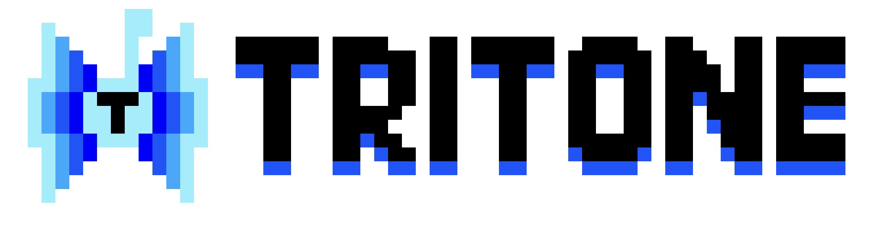

# 🔉TRITONE
[discord-game-sdk](https://discord.com/developers/docs/game-sdk/sdk-starter-guide)를 이용해 만든 **Minecraft 음성채팅 모드!!**

다운로드: [Windows 1.16.5](https://github.com/Iroom-gbs/tritone/releases/download/beta/tritone-beta.zip)

**아직 개발중인 버전으로 버그, 치우지 않은 쓰레기 등이 있습니다.**

## ✔ Tritone을 써야만 되는 이유!
* 서버에서 아무것도 안해도 동작합니다.(하이픽셀도 됩니다 :D)
* Discord를 사용했기에 음질도 매우 좋죠
* 설정이 쉽습니다. 한 두세줄이면 설명 될껄요

## ✖ 모드의 한계
* 뭐 음성채팅 되는 다른 Mod들도 많죠
* 디스코드가 3D 음향을 지원 안해서 배그같은데처럼 사플은 못해요...
* 디스코드로 만들었기에 디스코드가 깔려있어야됩니다!

## ❓사용법

### 🚀 설치하기!!
아직 Windows의 Minecraft 1.16.5 Forge밖에 지원을 못하고있어요... 아마 리눅스는 조만간 될꺼같네요

그냥 [이 파일](https://github.com/Iroom-gbs/tritone/releases) 을 mods폴더에 압축 해제하면 됩니다

**아 그리고, Discord가 켜져있어야되요!!!**
  
### ✏ 기본적인 사용법
그냥 이 모드를 깔고 아무 서버나 들어가면 그 서버에 있는 이 모드를 설치한 사람들이랑 음성채팅이 될꺼에요

* 'I' 를 누르면 음소거가 되고,
* 'M' 를 누르면 뮤트가 되요!!
* 물론 이것들은 설정에서 바꿀 수 있죠.

### ✒ 고오급 설정들
디스코드의 `applicationID`랑 자동으로 접속될 `lobbyname`을 `config.json` 파일을 수정해서 누구나 쉽게 바꿀 수 있어요!!

이 기능을 통해 내가 원하는 사람들이랑만 소통할 수 있게 되죠.
* clientID : 이거는 Discord에서 발급받아야되는데, 정 그러면 그냥 가본값 써도 되요
* lobbyname : Client id발급받기 귀찮으면 그냥 이거 원하는걸로 수정해도 되요.

**주의사항: ClientID랑 lobbyname은 같이 대화하고싶은 사람들이랑은 같은값이여야되요.**
~~한명만 외롭게 다른 로비에서 기다리고 있는 불쌍한 상황을 만들지 맙시다 ㅠㅠ~~

## 🚩앞으로...

### 진행중!!
* GUI(O키를 누르면 나오긴 하지만, 아직 아무런 기능도 없어요. 텍스쳐도 깨져보이죠)
* 포지 1.12.2 지원 예정
* Linux 지원 예정

### 조만간
* 포지 1.18.x 지원 예정
* 서버를 기준으로 로비를 자동으로 나누는 기능!(아마 config.json이 기본값인 경우만 적용될꺼에요)
* MacOS 지원
* 다중 언어 지원(아직 한국어랑 영어만 되요, 뭐 이걸 보고있는 당신이라면 이건 알 필요가 없는 정보겠지만요)

### 언젠가는...
* Fabric 지원(개발자중 아무도 Fabric을 할줄 몰라요)
* 1.19 이후의 포지 지원 ~~뭐 아직 나오지도 않았는데~~
   
## 빌드하는법!(개발자용)...
 * Discord에서 제공하는~~개떡같은~~SDK를 사용하느라 JNI를 사용했어요. 저 밑에 언어 사용 비율 보면 러스트가 있죠.
 * 그래서 사전작업을 좀 해야되요. 물론 Kotlin부분만 재작성할꺼면 필요 없기는 하죠.
 * [Discord game SDK의 러스트 바인딩!](https://github.com/ldesgoui/discord_game_sdk)
